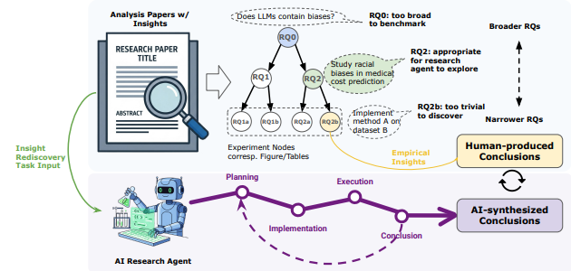

<h3 align="center">
  <strong>🔥 FIRE-Bench: Evaluating Agents on the Rediscovery of Scientific Insights</strong>
</h3>

<p align="center">
  <a href="https://arxiv.org/abs/2602.02905">
    
  </a>
  &nbsp;
  <a href="https://github.com/maitrix-org/FIRE-Bench">
    
  </a>
  &nbsp;
  <a href="https://firebench.github.io/">
    
  </a>
</p>


FIRE-Bench is constructed through **research-problem decomposition**, a process that transforms high-quality empirical analysis papers into **verifiable benchmark tasks**. This approach balances:

- **Exploratory freedom** (avoiding tasks that are too broad to benchmark), and  
- **Empirical verifiability** (avoiding tasks that are too narrow to allow genuine exploration).

We evaluate agent performance through **claim-level analysis**. Both agent conclusions **C_agent** and ground-truth conclusions **C_gt** are decomposed into **atomic, verifiable claims**. Overall performance is measured using **Precision**, **Recall**, and the **F_1** score.


## Workflow and Results
<table>
  <tr>
    <td style="width:50%; text-align:center; vertical-align:top;">
      
    </td>
    <td style="width:50%; vertical-align:top;">

<table>
  <thead>
    <tr>
      <th>#</th>
      <th>Agent</th>
      <th>Prec.</th>
      <th>Recall</th>
      <th>F<sub>1</sub> Score</th>
    </tr>
  </thead>
  <tbody>
    <tr>
      <td>1</td>
      <td>CC<sub>Sonnet-4</sub></td>
      <td><b>52.1</b><sub>±26.1</sub></td>
      <td>48.3<sub>±24.8</sub></td>
      <td><b>46.7</b><sub>±23.4</sub></td>
    </tr>
    <tr>
      <td>2</td>
      <td>CX<sub>gpt-5-med</sub></td>
      <td>44.8<sub>±24.1</sub></td>
      <td><b>49.0</b><sub>±28.5</sub></td>
      <td>41.9<sub>±25.4</sub></td>
    </tr>
    <tr>
      <td>3</td>
      <td>OH<sub>gpt-5</sub></td>
      <td>41.7<sub>±22.7</sub></td>
      <td>41.4<sub>±24.9</sub></td>
      <td>37.9<sub>±23.0</sub></td>
    </tr>
    <tr>
      <td>4</td>
      <td>OH<sub>o4-mini</sub></td>
      <td>36.8<sub>±18.5</sub></td>
      <td>36.6<sub>±19.2</sub></td>
      <td>31.9<sub>±17.6</sub></td>
    </tr>
  </tbody>
</table>

  </td>
  </tr>
</table>


## Setup

### Environment

```bash
mamba create -n firebench python=3.11  # or conda
mamba activate firebench
pip install -r requirements.txt
```

### API Keys

Create a `.env` file:

```
OPENAI_API_KEY=
GOOGLE_API_KEY=
HF_TOKEN=
ANTHROPIC_API_KEY=
USE_SUBSCRIPTION=1 (mark this as 1 if you want to use Claude Code subscription, 0 if using API key; note that some benchmark papers running on Claude models still require ANTHROPIC_API_KEY)
```

### Agent Dependencies

- **Codex**: `npx @openai/codex@0.39.0 --version` (v0.39.0 required for timestamp logging)
- **Claude Code**: [Setup guide](https://code.claude.com/docs/en/setup) or `curl -fsSL https://claude.ai/install.sh | bash`
- **OpenHands**: `export OPENHANDS_HOME=./.openhands; mkdir  -p ./.openhands` (Requires docker)

## Usage

### 1. Download Data for Specific Benchmark

In `benchmark` folder, some papers have empty `data` folder since the data can be loaded directly from HuggingFace. The sources of the data in nonempty data folder are described in `dataset.txt`.

### 2. Run Experiments

Edit `run_experiment.sh` to configure your agent/task/model combinations, then run:

```bash
bash run_experiment.sh
```

This iterates over all combinations of `AGENT_IDS`, `TASK_IDS`, and `LLM_MODELS`, calling `run_agent.py` for each. Results are saved to the `log/` folder.

**Parameters in `run_experiment.sh`:**
- `AGENT_IDS`: agents to run (e.g., `codex`, `claude_code`, `openhands`)
- `TASK_IDS`: benchmark tasks (e.g., `rational`)
- `LLM_MODELS`: models to use (e.g., `gpt-5`)

### 3. Evaluate Results

After experiments finish, evaluate the generated logs:

```bash
# Evaluate all agents/models/tasks
bash run_eval.sh --agents all --models all --tasks all

# Evaluate a specific run
bash run_eval.sh --agents codex --models gpt-5 --tasks rational --timestamp 20251016232701_10997
```

**Options:**
- `--agents`: agent name or `all`
- `--models`: model name or `all`
- `--tasks`: task name or `all`
- `--timestamp`: (optional) evaluate a specific run by timestamp

